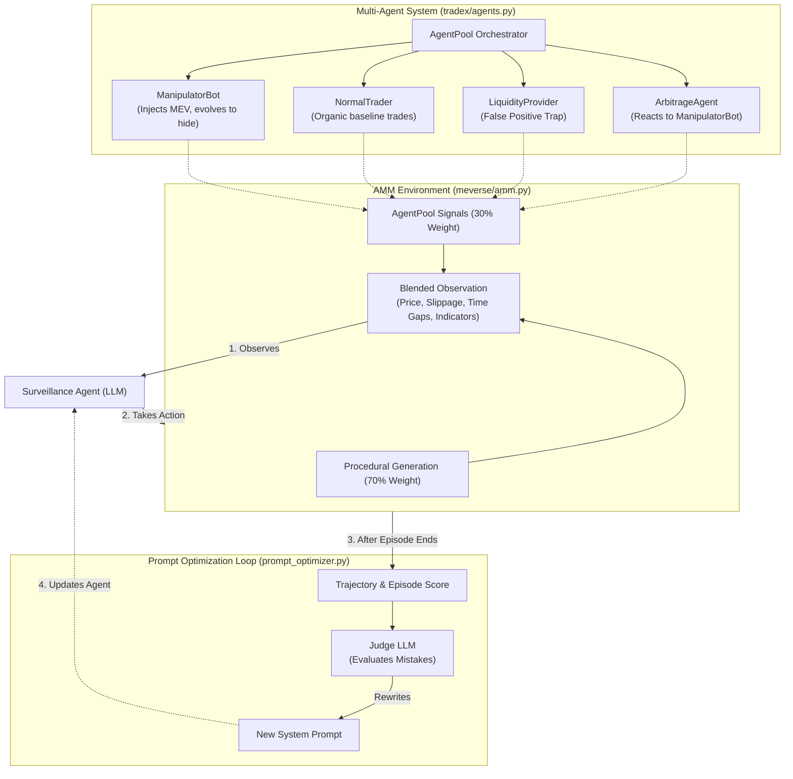

# TradeX: Bot-Aware Market Surveillance in Simulated AMM Trading

## What is TradeX?
TradeX is an advanced reinforcement learning benchmark environment built on the [OpenEnv](https://github.com/openenv) framework. It simulates a constant product Automated Market Maker (AMM) pool (like Uniswap v2) and tasks an AI agent with acting as a **market surveillance controller**.

The agent monitors real-time trading metrics and decides whether to `ALLOW`, `MONITOR`, `FLAG`, or `BLOCK` activity, balancing the need to stop malicious bots while protecting normal, healthy market flow.

## What Problem is it Solving?
Decentralized Finance (DeFi) is constantly targeted by algorithmic MEV (Maximal Extractable Value) bots performing sandwich attacks, frontrunning, and JIT liquidity manipulation. 

TradeX provides an adversarial, decision-intelligence sandbox to evaluate and train AI agents to police these decentralized financial protocols. It challenges agents to spot complex market manipulation patterns without penalizing organic traders. 

## Who is this for & Why Use It?
TradeX evaluates the detection intelligence that could one day feed structural defenses. It is designed for:
- **AI Researchers:** To benchmark LLMs, RL, and hybrid agents on identical adversarial scenarios, providing a standardized OpenEnv certification benchmark for MEV surveillance.
- **DeFi Security Engineers:** To target the residual threat surface (e.g., cross-domain attacks that don't depend on mempool visibility) and achieve population-wide visibility over all market activity.
- **Data Scientists:** To experiment with prompt optimization and generate labeled datasets of MEV attacks, which pure mitigation tools (like Flashbots Protect) cannot produce.

## Positioning: Where TradeX Fits in the MEV Stack

MEV defense is not a single layer, and TradeX does not compete with the tools usually named alongside it. Three distinct layers are worth separating:

- **Venue layer — Uniswap:** The AMM where trades execute and MEV is extracted. Uniswap is permissionless: no controller, no admin, no party that can reject or reorder a swap. It is the thing being *attacked*, not a defense.
- **Infrastructure layer — Flashbots:** Market-structure infrastructure that *mitigates* MEV by changing how transactions reach a block (e.g., Flashbots Protect, MEV-Share). It mitigates structurally; it does not classify attacks.
- **Evaluation layer — TradeX:** A reproducible benchmark for *detection agents*. It does not execute trades, route order flow, or build blocks. It scores how well an agent identifies suspicious activity.

**TradeX is not a competitor to Uniswap or Flashbots — it is complementary.** Uniswap is the venue; Flashbots protects the venue's users structurally (via hiding); TradeX evaluates the detection intelligence that could feed into structural defenses.

### Hiding vs. Detection

The dominant production defense today is *hiding* (e.g., Flashbots Protect), which routes transactions privately so they never appear in the public mempool. Hiding performs no attack classification at all. 

Both hiding and detection optimize for different goals:
- **Hiding:** Protects a specific user's trade with near certainty, but is opt-in only and blind to attacks not reliant on mempool visibility. Hidden attacks teach nothing.
- **Detection (TradeX):** Surveils the whole market population-wide. It generates the labeled datasets needed to understand novel attacks, though it acts probabilistically (can have false positives).

Hiding gives certain protection to those who opt in; detection gives universal coverage but only probabilistically. Neither dominates — they cover each other's blind spots.

## Core Features
- **Multi-Agent Simulation Ecosystem:** TradeX features a dynamic `AgentPool` where evolving `ManipulatorBots`, organic `NormalTraders`, reactive `ArbitrageAgents`, and `LiquidityProviders` (acting as false-positive traps) interact and generate complex market signals.
- **Iterative Prompt Optimizer:** Includes a closed-loop "LLM-as-Judge" optimizer (`prompt_optimizer.py`) that iteratively refines the surveillance agent's system prompt based on trajectory feedback, automatically improving detection accuracy across different task difficulties.

  **Optimization Workflow:**
  ```text
  Step 1: Market generates observations (meverse env)
              ↓
  Step 2: Surveillance Agent (LLM, prompt_v_n)
          sees: burst_indicator, pattern_indicator, etc.
          decides: ALLOW / MONITOR / FLAG / BLOCK
              ↓
  Step 3: Action sent to env
          env updates state and computes per-step rewards
              ↓
  Step 4: After episode ends → Judge LLM sees:
          - Surveillance Agent's trajectory + its prompt
          - Per-step rewards
          - Final score breakdown (detection, false positives, etc.)
              ↓
          Judge outputs:
          - Improved Surveillance prompt_v_n+1
              ↓
  Step 5: Next episode runs with the improved prompt
  ```
- **Adaptive Difficulty:** Bots use stealth mechanics and adapt to your agent's success rate—if you miss an attack, the bots get bolder; if you block them, they back off.
- **Visual Dashboard:** Includes a Gradio-based interactive UI (`dashboard.py`) to run episodes, compare baselines, and review telemetry.

## Multi-Agent Architecture

TradeX doesn't just rely on procedural math; it runs a live orchestrator of distinct, interacting bots that blend their signals into the environment.



## Avoiding Reward Hacking

TradeX implements several mechanisms to prevent the Surveillance Agent from "gaming" the reward function (e.g., just blocking every transaction to artificially inflate its detection score, or relying on a single simplistic metric).

1. **False Positive Traps (Liquidity Providers):** The Multi-Agent system includes a `LiquidityProvider` bot that generates highly patterned activity. If the Surveillance Agent relies purely on the `pattern_indicator` to issue a `BLOCK`, it will accidentally block the Liquidity Provider, triggering severe false-positive penalties.
2. **Adversarial Bot Evolution:** As episodes progress, the `ManipulatorBot` enters "Stage 3" (anti-hacking mode). It deliberately mimics normal trading time gaps (spacing trades > 1.0s) while still injecting malicious volume. This forces the agent to look beyond simple rapid-fire heuristics and analyze deeper price impacts.
3. **Balanced Reward Function:** The environment grades the agent using a strict weighted formula: 50% for Detection, but 20% penalty for False Positives, 15% penalty for False Negatives, 10% for Market Health, and 5% penalty for Overblocking. The LLM Prompt Optimizer is explicitly instructed about this balance to ensure it doesn't converge on a trigger-happy "BLOCK-all" strategy.

## How to Use (Quick Start)

> [!TIP]
> For a comprehensive guide covering the full project structure, required API keys, detailed run commands, and log file explanations, please read the **[How to Use Guide](How_to_use.md)**.

Run the official multi-task benchmark (requires `API_BASE_URL`, `MODEL_NAME`, and `HF_TOKEN` environment variables):
```bash
python inference.py
```

Launch the visual dashboard for debugging and episode comparison:
```bash
pip install gradio plotly numpy
python dashboard.py
```

Run the Prompt Optimizer loop:
```bash
python prompt_optimizer.py --task full_market_surveillance --iterations 5 --seed 42
```

## Meverse Training Results

Below are the graphs and plots detailing the performance of the Meverse agent over the training period and comparing it against the baseline.

### Baseline vs Trained Performance


### Reward vs Training Step


### Task Scores Comparison


## Future Integration with Uniswap

While TradeX currently uses synthetic market data, future integration with real Uniswap state splits into two operations:

**Reading real pool data IN (feasible, near-term):** Replacing the synthetic observation generator with real Uniswap activity.
- *Archive / subgraph replay:* Map historical Uniswap swap events into the observation schema. Easiest; preserves determinism.
- *Forked-state simulation (recommended):* Fork mainnet with Foundry/Anvil and run trades against the real Uniswap v2/v3 contracts. Real AMM math, real pool state, zero cost, still deterministic.
- *Live mempool feed:* Real-time detection. Hardest; breaks determinism; turns the benchmark into a live monitor.

**Acting on the pool OUT (hard, and never on Uniswap directly):** 
Uniswap is permissionless — there is no hook to "block" a swap. The only layer where a detection decision becomes a real consequence is the **block builder** (e.g., Flashbots' open-source rbuilder). The honest end-state architecture is:

> **TradeX detection agent** → emits a classification → feeds a bundle-ordering/filtering policy inside a **builder** → tested locally, no mainnet, no real funds.

*Note:* Filtering others' transactions sits in tension with the censorship-resistance ethos of decentralized building (BuilderNet). Production-real protection remains private order flow (hiding the victim), which detection ontology does not directly replace.

## Papers

- [Know Your Intent: An Autonomous Multi-Perspective LLM Agent Framework for DeFi User Transaction Intent Mining](https://arxiv.org/html/2511.15456v1)
